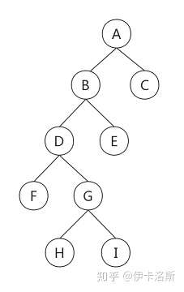
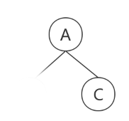
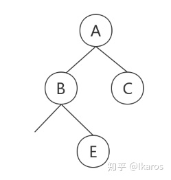
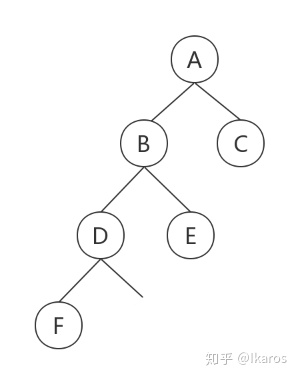
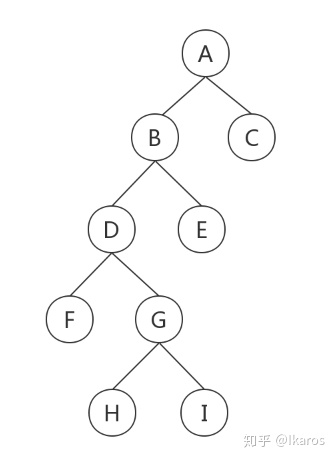

## 二叉树遍历

#### 二叉树

前序遍历 A-B-D-F-G-H-I-E-C

中序遍历 F-D-H-G-I-B-E-A-C

后序遍历 F-H-I-G-D-E-B-C-A

#### 前序、中序还原

已知二叉树前序遍历和中序遍历，请还原二叉树。

在前序遍历中，确定根节点为A，从中序遍历得出F-D-H-G-I-B-E在左边，C在根节点右边。

那么剩下的前序遍历为B-D-F-G-H-I-E，中序遍历为F-D-H-G-I-B-E，B就是我们新的"根结点"，从中序遍历中得出F-D-H-G-I
在B的左边，E在B的右边，继续构建。

那么剩下的前序遍历为D-F-G-H-I，中序遍历为F-D-H-G-I，D就是我们新的"根结点"，从中序遍历中得出F在D的左边，H-G-I在
D的右边，继续构建。

那么剩下的前序遍历为G-H-I，中序遍历为H-G-I，G就是我们新的"根结点"，从中序遍历中得出H在G的左边，I在G的右边。

#### 后序、中序还原

从后序遍历中，我们确定了根结点为A，在从中序遍历中得出 F-D-E-B-C 在根结点的左边，C在根结点的右边，那么我们就可以
构建我们的二叉树的雏形。		

和前序和中序还原二叉树一样，我们同理可以通过中序和后序还原二叉树。

光有前序遍历和后序遍历是无法还原二叉树的。
